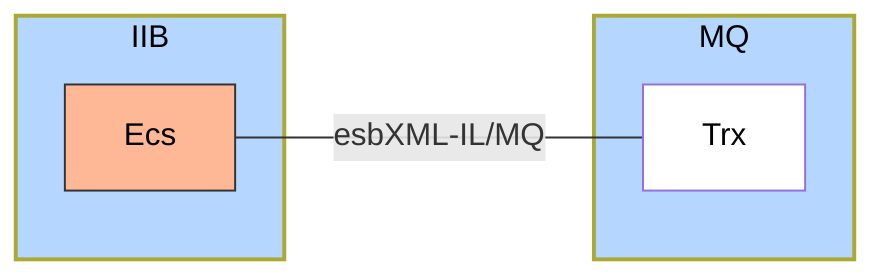
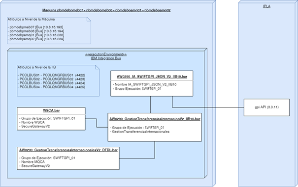

## **Estándares soportados**

- **esbXML-SOI** (Version 1.0): Estándar de mensajería del servicio cuando es expuesto para su consumo por SOAP.
- **SOAP** (Versión 1.1): Estándar SOAP soportado por el servicio.

## **Modelo de componentes**

### Channel Adapter WS
Componente de Frontera que se encarga de Transformar la mensajería del consumidor esbXML-SOI a formato esbXML-IL y viceversa. 

Adicionalmente se encarga de realizar un manejo estándar de los errores y excepciones que se puedan presentar en la invocación del adaptador. 

Por último, se encarga de realizar la invocación al componente Service Gateway para enrutar el mensaje al componente de servicio específico.

- **Estilo de interacción**: Request/Reply
- **Estilo Técnico Comunicación**: Asíncrono

### Channel Adapter MQ
Componente de Frontera que se encarga de Transformar la mensajería del consumidor esbXML-SOI a formato esbXML-IL y viceversa. 

Adicionalmente se encarga de realizar un manejo estándar de los errores y excepciones que se puedan presentar en la invocación del adaptador. 

Por último, se encarga de realizar la invocación al componente Service Gateway para enrutar el mensaje al componente de servicio específico.

- **Estilo de interacción**: Request/Reply
- **Estilo Técnico Comunicación**: Asíncrono

## **Vista técnica**

### Diagrama técnico
En esta vista se muestran componentes implementados en unidades de despliegue dependiendo de la plataforma.

### Características técnicas
Características técnicas relevantes y asociadas a los componentes, están relacionadas en la siguiente tabla:

- **Registro en Registry**: El servicio se debe inscribir en el registry para que las peticiones se puedan enrutar de manera adecuada.
- **Características de las colas**: Las colas a generar en MQ deben ser tipo NO persistentes, con una profundidad de 5,000 mensajes y una longitud por mensaje de 4 Mb.
- **Registro en el Tracing Manager**: Se debe hacer inscripción en el Tracing Manager de los errores generados internamente en el componente y de los errores recibidos de los componentes con los que tiene dependencia.

## **Trazabilidad del servicio**
En la siguiente tabla se selecciona el nivel de trazabilidad de los mensajes para cada una de las operaciones del servicio:

|Operación|Cabecera (esbXML)|Cabecera (MQMD)|Carga útil|Mensaje completo|System Exception|
|:-:|:-:|:-:|:-:|:-:|:-:|
|confirmarEstadoTransferenciaRecibida||||X|X|

## **Decisiones de realización**

### Ambiente de exposición del servicio
Se requiere que el servicio sea expuesto en el ambiente estable y con la mayor cantidad de capacidades.

Alternativas:
- Integration Bus 10
- App Connect Enterprise 11

Decisión:
- Integration Bus 10

Implicaciones: Se expone el servicio para su consumo a través de MQ/EAI-XML y Https/SOI-XML.